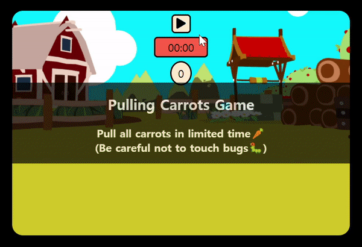
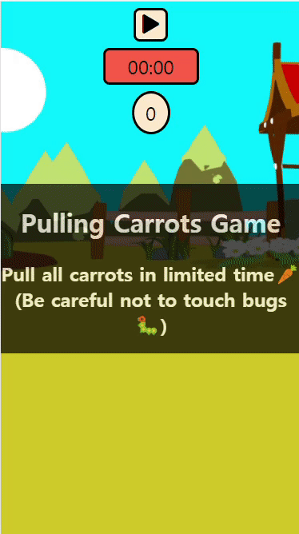

# Pulling Carrots Game 🥕🥕🥕

정해진 시간 내에 벌레를 피해 모든 당근을 뽑으면 이기는 게임 

**_[🐛움직이는 벌레들이 등장하는 버전을 확인해보고 싶다면 클릭](https://github.com/hyunji-lee-dev/pulling-carrots-game-canvas)_**
|데스크탑|모바일|
|:--:|:--:|
|||

## 게임 해보기 👉 [Live Demo](https://hyunji-lee-dev.github.io/pulling-carrots-game/)

### 진행방법

1. ▶ 버튼을 클릭해 게임을 시작한다. (중단하려면 ⏹ 버튼 클릭)
2. 당근을 하나씩 클릭해서 뽑는다. 모든 당근이 뽑히면 승리🎉
3. 벌레를 클릭하거나, 제한시간이 지나면 패배☠
4. 게임결과 창에서 리플레이 버튼이나 종료 버튼을 클릭한다.

## 사용기술

- HTML
- CSS
- JavaScript
- Web APIs

## 구현사항

### ▶ 버튼 클릭 시 게임 시작

- 당근들과 벌레들을 랜덤한 위치에 배치
- 남은 시간을 보여주는 타이머 시작
- 남은 당근 갯수를 나타내는 카운터 초기화

### 아이템 클릭 처리

- 당근을 클릭하면 사라지고, 모든 당근이 사라지면 승리 결과창이 나타남
- 벌레를 클릭하면 패배 결과창이 나타남

### 기타

- 그 외 버튼들 클릭 처리
- 효과음 및 배경음악 추가
- 클래스 별 모듈화

## 참고자료

- [드림코딩 아카데미](https://academy.dream-coding.com)
- MDN Web Docs
